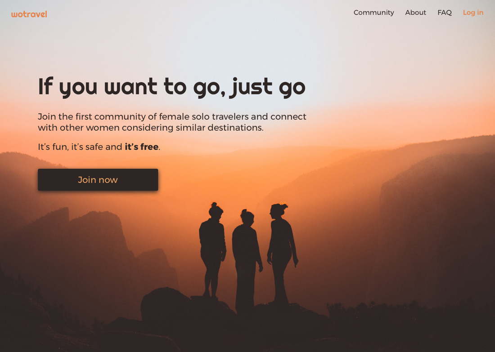
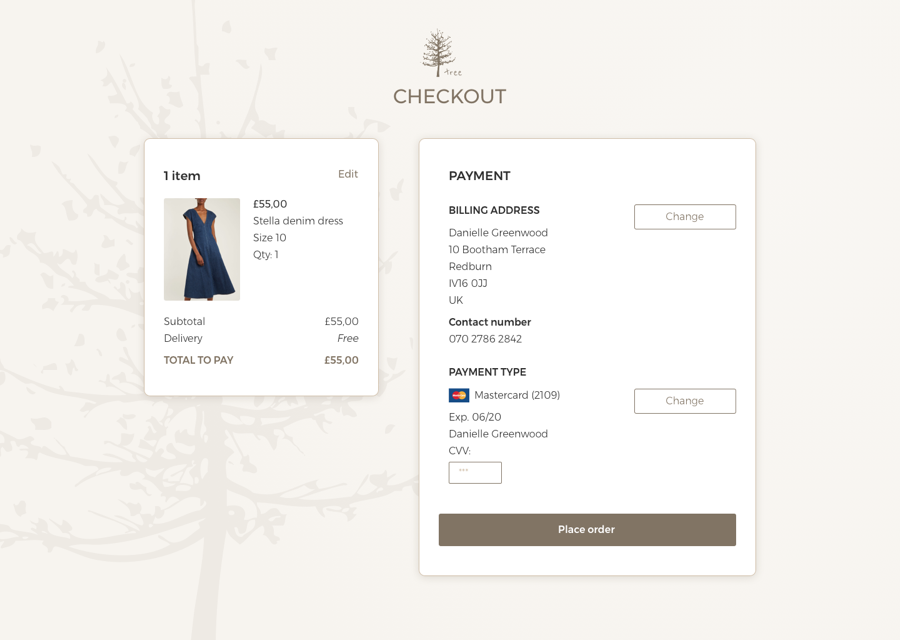

As part of a plan to improve on my UI skills, I have decided to go through the [100 Days of UI](http://www.dailyui.co/){:target="_blank"} challenge.

#### Day 03 | Landing page | 50 mins

Very simple landing page for a social network for female travelers looking for companionship during their time abroad. There's not much to it, but LOVED the image, so – yeah. 

#### Day 02 | Credit card checkout | 3-4 hrs

Checkout page for an independent e-commerce business selling clothes. The design is subtle and understated.

#### Day 01 | Sign up screen | 2-3 hrs

Sign in screen for an app targeted at bycicle riders wanting to find their way around a specific city. Like Citymapper, but for bikes. The idea comes from a particular problem I often face when trying to find my way around London.

This sign in screen assumes the user already has an account.