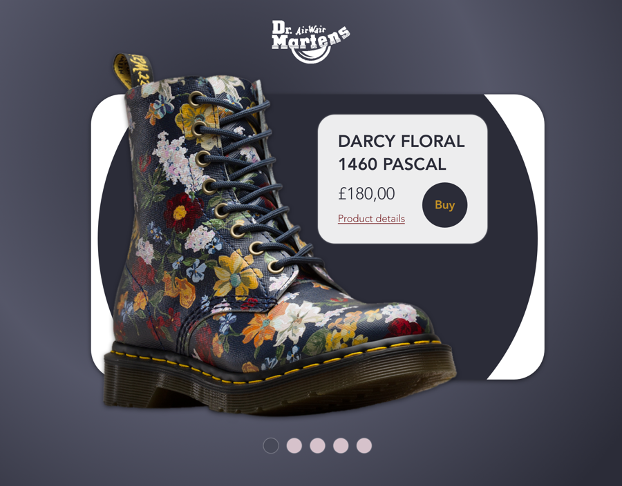
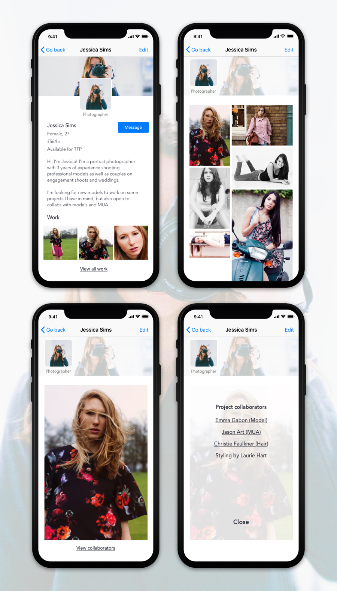

As part of a plan to improve on my UI skills, I have decided to go through the [100 Days of UI](http://www.dailyui.co/){:target="_blank"} challenge.

#### Day 12 | Single Product Page | 3-4 hrs

Two versions for the same product: a pair of patterned Doc Martens boots.

I think the first one looks better, but the second one is way more functional, displays more information and is a better option on the whole.

#### Day 11 | Flash messages | 2 hrs

Adorable vectors by [Drawnhy97](https://www.freepik.com/free-vector/coloured-girl-avatars_872952.htm){:target="_blank"} to inform a user when they've gotten some German words right – or when they haven't. 

#### Day 10 | Social Media Share | 2 hrs

Sharing buttons for Instagram – whatsapp, Twitter and Facebook. I turned it into an animation to continue working on that.

#### Day 09 | Music player | 3 hrs

Very simple design for a music player, using shadows to add some texture and a white, minimalist background.

The background would change colour depending on the colour scheme of the record cover.

#### Day 08 | 404 error page | 2 hrs

I had an idea of having an 404 error page with a list of random things to do (to draw that smile on their faces) and a maze they could complete containing the numbers "404".

I'll be honest, I don't love this, but that's the best I've been able to do so far. Might revisit this one in the future.

#### Day 07 | Settings Screen | 1 hr 30 mins

I spent more time working this one out and thinking what app I'd be designing settings for and what settings would be included rather than on the actual UI. 

I also looked at other apps on my phone to understand behaviour and information architecture, especially in how they split Push and Email notifications. I found inspiration in Strava's settings screen in particular.

This is a Settings Screen for the same app I worked on for Day 06.

#### Day 06 | User profile | 3hrs

User profile for an app where photographers, models, MUAs and other artists can connect and schedule photoshoots.

Screens are for a Photographer's user profile, where gender, age, rate and Time For Print (free work) availability. For models, the list of details would also include height, age, hair color, eye color, weight, tattoos, etc.

The user can also view the photographer's gallery, individual photos and any details on the photoshoot participants.

#### Day 05 | App Icon | 2hrs

Design of an icon for an app aimed at skiers and snowboarders that need to find out more about snow conditions when training.

I wanted to illustrate this from scratch, so I went for a simple design using triangles and ovals that I then deformed to create the snow. The color scheme is influenced by the background photo.

#### Day 04 | Calculator | 1hr

Super simple re-design of a calculator. Tried to find some inspo but couldn't find anything exciting AND functional at the same time, so ended up going with a ready-tested design of a calculator app for iPhone.

#### Day 03 | Landing page | 1hr 30min
Very simple landing page for a social network for female travelers looking for companionship during their time abroad. I loved the image, and also spent some time figuring out how to do animations on Sketch using the Timeline plugin :)

#### Day 02 | Credit card checkout | 3-4hrs
Checkout page for an independent e-commerce business selling clothes. The design is subtle and understated.

#### Day 01 | Sign up screen | 2-3hrs
Sign in screen for an app targeted at bicycle riders wanting to find their way around a specific city. Like Citymapper, but for bikes. The idea comes from a particular problem I often face when trying to find my way around London.

This sign in screen assumes the user already has an account.
