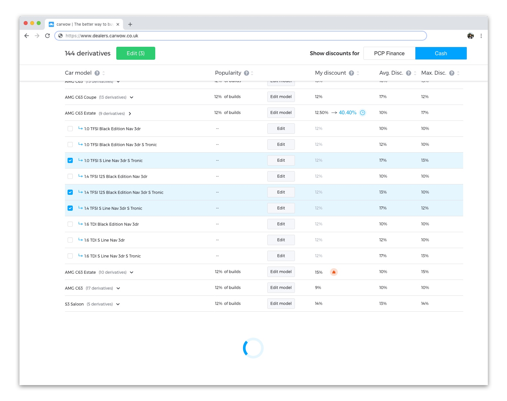

* **Project type:** Work project
* **Duration:** 2 months
* **Tools:** Pen and paper, Sketch, Whimsical, Invision
* **Processes:** User research, User testing, Paper Sketching, Wireframing, Prototyping

[carwow](https://www.carwow.co.uk/){:target="_blank"} is a marketplace for car buyers and car dealers where buyers can find the best deals on a car and dealers can increase their chances of selling a car. I was part of Supply, a team of 8 developers, 2 product managers and 2 designers looking after the web application dealers use to manage incoming enquiries, conversations with users, stock and overall dealership performance.

### The problem

The current Pricing Page allows dealers to view a list of the models they are already selling and the discount (pricing) they are selling them at. It also gives them an overview of the market by displaying the average and maximum discount for that car (on carwow).

Because it's display only, in order to make changes to their pricing dealers have to contact carwow's HQ and speak to their Partnership Manager. This involves dealers having to create a separate spreadsheet with all their pricing changes for models and derivatives, sending that across to their PM and then having the PM manually input the data and make the changes. 

It's an inefficient system that relies heavily on carwow's workforce doing admin work and prevents dealers from taking full ownership of their carwow account.

### Requirements

The new Pricing Page had to enable dealers to do the following:

- Make changes to their pricing both at model and at derivative level
- Be able to identify newly added models and prompted to set up a pricing for them
- View average and maximum discounts on each model
- Be able to identify which models have an added Hot Deal discount
- Be able to identify when pricing changes are being reviewed, as the current process doesn't allow for this to happen instantaneously (any changes require approval from the Partnership Management team)

### Solution

The new Pricing Page takes the shape of a table that lists all models and all derivatives, including those that don't have a pricing yet.

- The **flame icon** indicates that a model is on a Hot Deal discount, a short term discount that runs for a short period of time and is added to.
- Models can be selected and edited **in bulk** or individually.
- Derivatives can also be selected and edited **in bulk** or individually.
- When more than one item is selected, the green **Edit button** appears next to the Derivative count.
- Changes to the pricing are requested through a modal form (not shown). Once the request is finalised, feedback is displayed through the **alert at the top**.

### Conclusions

This project required a massive team effort, as it grew in complexity the more in depth we went, and the following people where also involved in the design process:

- Chris Manning and Seb Margolis – Product Managers
- Amardeep Rai and Brent Palmer – Product Designers
- Kate Sims – User Researcher
- Luke Williams, Emiliano Mancuso, Stephen Lloyd, Jade Dickinson and Christian Gregg – Software Engineers
- Tilly Smallwood and Will Jackson – Partnership Team

**Who knew something so simple could turn into something so complicated?** 

There were so many iterations for this project that I lost count, mostly because problems arose on every front. From the way the data was stored, to actual usability problems, to the pricing system and process itself, the Pricing Page was challenging in every way. 

Here's what I learned from this project:

- Get *all of the requirements* from the start. Make sure everything that needs to be included is in the brief from the start. Push, and push, until you can be certain that that is the case.
- Speak to the devs early on to figure out how data is stored and what the limitations and constraints are in terms of functionality.
- Do a hella lot of testing. And when you have, test more. Get the flows right and the job is halfway there.

