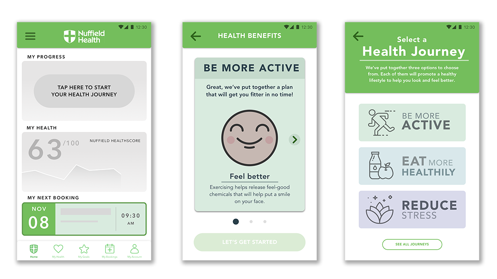
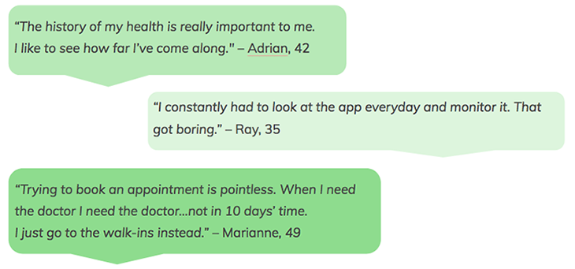
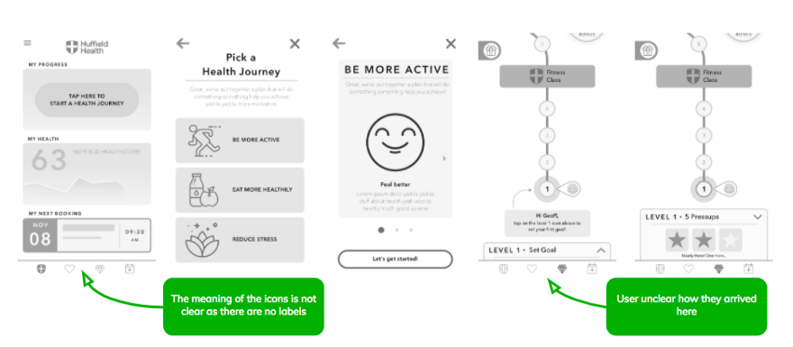
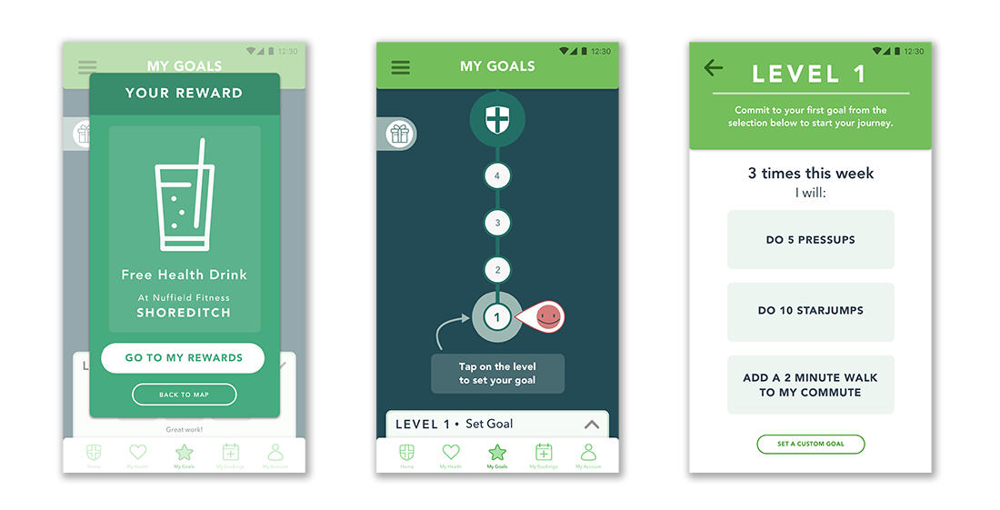

* **Project type:** Concept project
* **Participants:** Max Cameron-Taylor, Hugo Nickols, Irene Alegre
* **Duration:** 2 weeks
* **Tools:** Pen and paper, Sketch, White walls, Invision, Marvel
* **Processes:** User interviews, user testing, branding, design studio, sketching, prototyping, persona creation, user flows, experience mapping
* [**Link to final prototype**](https://invis.io/YNONTVVGRFZ#/326463901_1){:target="_blank"}

> “Nuffield provides their customers with what they need, when they need
> it”

Nuffield Health is one of the leading not-for-profit UK healthcare
organisations, looking after people for more than 60 years. They offer a varied
arrange of services, from gym facilities and fitness classes to health
assessments, physiotherapy and medical treatments.

## The Brief: Nuffield’s Integrated Services Approach

Our client wanted an app that would allow their customers to **book medical
appointments** and other Nuffield Health services, but the app should also
**track the user’s health progression and encourage them to quit unhealthy
habits and incorporate better lifestyle choices** into their lives.

## Checking Out The Competition

There are many apps to track your health.
But no app does it all. **What the
Nuffield Health app can do well, however, is integrate both the booking and
health tracking in one app. That should be Nuffield Health’s USP (Unique Selling
Proposition).**

## User Research: Talking To People

The problem of people not being healthy is *not* knowledge.
People know what they should be doing to stay healthy and/or become healthier:
exercise and eat their greens. That’s not the problem.

**The problem is willpower. The problem could actually be solved
by designing a tool that encourages and helps users to create new, healthier
habits.**

## Meet Geoff Perkins

This is Geoff, he’s our persona. Geoff is 41, married, with two kids. He’s a busy IT Manager and doesn’t have a lot of time to look after himself, which means he has been slowly piling on some pounds. And now **he wants to lose the extra weight in order to be able to keep up with his kids.**

We believe Geoff needs to be more active and eat better, which in turn will
boost his energy levels, which in turn will help him stay motivated to continue
being more active and eating better. **It’s an endless cycle of improvement.**

**Our app will help Geoff incorporate and maintain healthy habits, as well as
allow him to make doctor’s appointments quickly.**

## Sketching and Designing The Booking Screens

The design of the booking screens was fairly straightforward. Below are the
iterations for three of the main screens, and some of the feedback we received
at each stage.

<figcaption>From left to right: paper, mid-fidelity and high-fidelity booking screens.</figcaption>

<figcaption>From left to right: paper, mid-fidelity and high-fidelity booking screens.</figcaption>

<figcaption>From left to right: paper, mid-fidelity and high-fidelity booking screens.</figcaption>

## Sketching and Designing the Health Tracker

**Originally we thought a health tracker would encourage Nuffield Health
customers to make better lifestyle choices**, so we designed a screen that would
track different health stats such as BMI, blood pressure and blood test results.
**The data would be inputed by the Health Specialist during the quarterly Health
MOT** (a Nuffield Health service that runs a general medical check on customers
every three months). This, in theory, would allow customers to track their
progress.

We thought users would be excited about this feature. Delighted. Instead, this
is the feedback we got.

Which makes sense. So we scrapped that and came up with a solution that was
completely different.

## Creating Tiny Habits

BJ Fogg, PhD, is the creator of the concept of [Tiny
Habits](http://tinyhabits.com/){:target="_blank"}. His [TED
talk](https://www.youtube.com/watch?v=AdKUJxjn-R8&t=27s){:target="_blank"} is quite famous and his
premise quite simple. According to BJ Fogg, only three things will change
behaviour in the long term.

* **Having an epiphany**
* **Changing your environment** (what surrounds you)
* **Taking baby steps**

[Fabulous](https://play.google.com/store/apps/details?id=co.thefabulous.app&hl=en_GB){:target="_blank"},
an app that claims to increase your energy levels, feel vibrant health, lose
weight and sleep better by instilling healthy habits and routines in your life,
does this pretty well. Here are two user reviews for this app:

## Making Healthier Habits a Delight

Becoming healthier has never been this fun. Maybe this is a bit of an
overstatement, but it’s our app, so we feel sort of entitled to say this.

Below are the first sketches of our *Goals Screen*. **The user is prompted to
set a new goal, and then is taken through several screens that give them several
options, briefly explain the benefits of the selected goal and finally guide
them through the process of completing it.**

<figcaption>Screen flow.</figcaption>

<figcaption>Mid-fidelity prototype and feedback.</figcaption>

<figcaption>High-fidelity prototype.</figcaption>

## Next Steps

This is by no means a finished job. Here are the features we’d like to focus on
next:

* Develop a section for users to learn how to be more mindful with guided
meditations and breathing exercises
* Develop a *My Health* screen that gives customers a full overview of their
health
* Allows app users to tackle two or more journeys at the same time (eg. being more
active and reducing stress)
