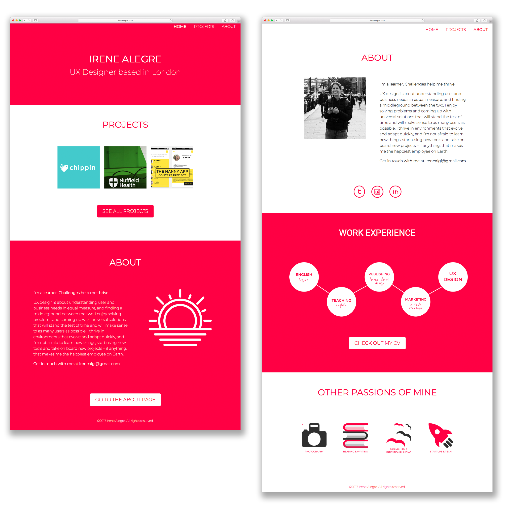

* **Project type:** Personal project
* **Participants:** Irene Alegre
* **Duration:** 1 month
* **Tools:** Pen and paper, Sketch, HTML & CSS, GitHub, MacDown
* **Methodologies:** User interviews, user testing, branding, sketching

I like my portfolio. I mean, it’s not, like, the best portfolio ever, but I like
it. It’s clean, it’s aseptic, it has just a tiny little bit of hot pink popping up here or there. It makes me feel kind of good.

But it wasn’t always that way.

## Defining the specs

So many things could go in there; my photography, my blog, my Harry Potter
collection! At first I went a little but crazy. I mean, I’d never had my own web
page before and I just wanted it to have it all.

But I was sensible. I *am* a sensible person, after all. So I just kept the idea
of the blog, and then chucked everything else in there. Because you can turn a
blog into *anything*.

So after battling against my own desires, I settled down to keep the following
sections:

* **Home page:** this would have an introduction, plus the most recent case
studies
* **Case studies page:** this would compile all the case studies
* **About page:** this would tell the user all about me and my hobbies
* **The blog:** in here I would write a lot about *stuff* (to be fair, I do write
quite a lot)

## Defining the style

I’m a minimalist, so I went with a 3-colour palette: white, black and hot pink.
I picked one typeface — Montserrat– as the main font. Here are some of my
screens.

It was alright, although people were a bit shocked by its pinkness. But when I
added the images for the case studies, the pink suddenly clashed with everything
else. Alas, most portfolios are white — or black– for a reason.

Suddenly, I wasn’t happy with it anymore. I hated it.

## Re-designing and re-building

**By then I had actually built the site with some help from my very patient
partner [Arturo Herrero](http://arturoherrero.com/){:target="_blank"}, but mostly on my own.** I was really impressed with myself,
although when Arturo saw the CSS sheet he almost cried. Apparently it was quite
messy, but hey — it worked.

Regardless, that pink was killing me and it had to go. So off it went. **At that
point I started to look at many other Junior UX portfolios, which I had avoided
doing before because I was afraid I would end up copying them,** but I found the
process quite useful to get some ideas.

I decided that **I would place the case studies vertically on the home page** —
rather than horizontally– so that they wouldn’t look weird if it was there were
more than three, or less than six. That way I could also add a brief explanation
for each of the projects.

And then Arturo said:

> Do you really need a Case Studies page if you only have three case studies?

Which was a fair point. Because, no, I really didn’t. It’s just that everyone
has one, and so I thought I should have one myself. So I scrapped that too.

**And I started simplifying. I removed everything that wasn’t truly necessary.**

* The circled images
* The fancy graphs
* The words “Case Studies”
* The “passions” section, whatever that was

**And here’s what I kept**

* A home page with my few case studies
* An about page with a photo, some links and my contact details
* A link to the blog

## Changing the font

I know that — in theory– sans-serif fonts work better on the web, but I really
like *Medium*’s format, and the platform uses a big serif font. PT Serif at
21px, to be more exact. And, yes, that’s what you’ll find on my website because,
if something works, there’s no point in fixing it.

## Designing the blog
I was inspired by Arturo's own website, which has an archive with some content he's written over the years. I liked the simplicity of it, and the fact that I could have the link at the top take users to a list with all the blog posts, and they could always go back to the same link for more, thus removing the need for pagination.

It was clean and functional.

## Designing alongside a dev

Arturo said he would build the website himself (and yes that is a [Virginia
Woolf
reference](https://genius.com/Virginia-woolf-mrs-dalloway-part-1-annotated){:target="_blank"}
because I’m a freak), so now I had to have a good idea of what I wanted and how
I wanted it. A really good idea.

**Arturo had many questions.**

* What size are the images? — *450x450*
* What size is the font? — *21px*
* Is this a title? And is *this* a title? Can they be the same style? Why not? —
*because they convey different types of information*
* Are blog posts and case studies going to look the same? — *yes*
* What’s the distance between this and that element? ...

## Conclusions

I have enjoyed the process of putting together my own website, and it has taught
me a lot about no-nonsense design, as well as user experience. Because, ultimately, my
website is not really meant to be seen by me.
