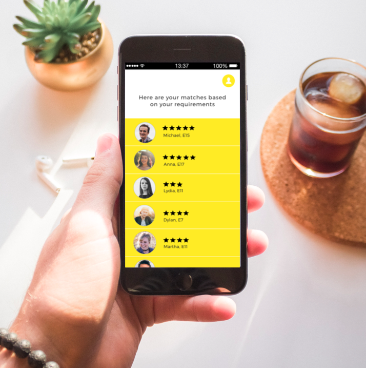
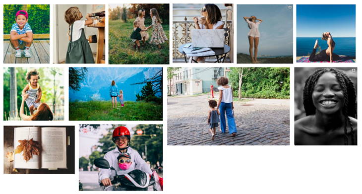
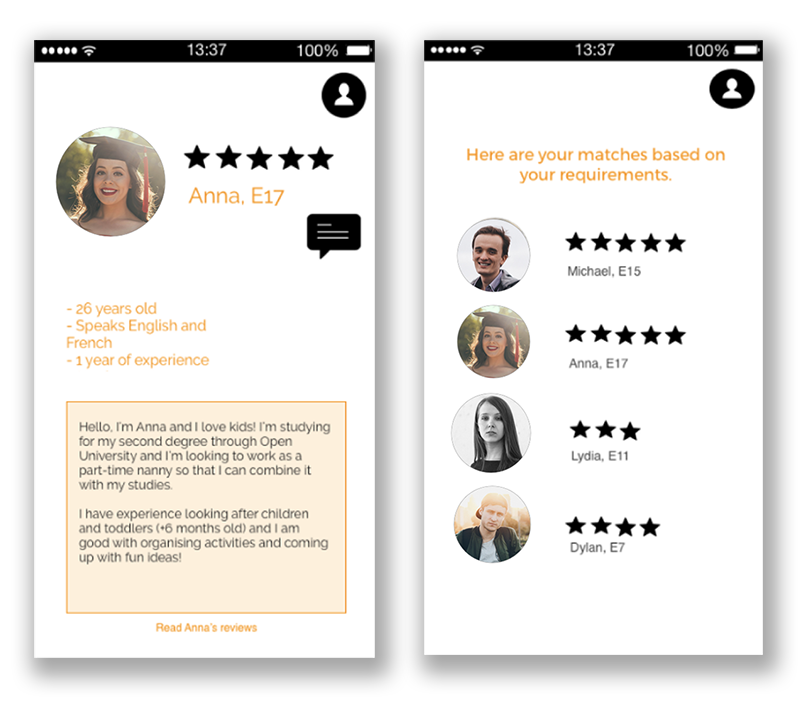
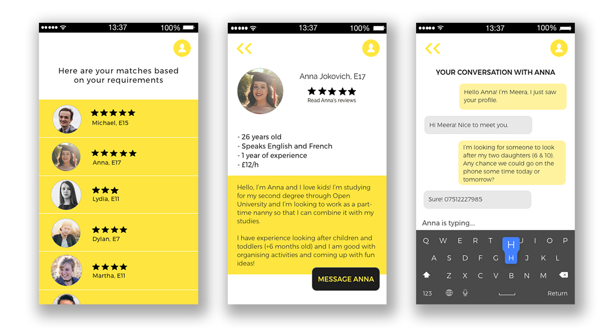

* **Project type:** Conceptual
* **Participants:** Irene Alegre
* **Duration:** 2 weeks
* **Tools:** Pen and paper, Omnigraffle, Sketch
* **Methodologies:** User interviews, user testing, branding, storytelling, sketching, prototyping

The Nanny App is being designed to **enable
parents and nannies to meet up and arrange a babysitting schedule that works for
everyone.**

<figcaption>Storyboard representing the User Journey</figcaption>

During my user interviews with my colleague Meera, I came to the conclusion
that **juggling work and family lives can be a challenge, and recurring to
someone for support can help. However, sometimes even *that* may not be enough**,
given that children schedules can be quite complicated.

## There’s an app for that

What if Meera had an app that enabled her to find nannies who are available at
specific times or during specific days?

<figcaption>User flow focusing on the “parents” side of the marketplace</figcaption>

After a little bit more research, I pinned down the app’s main features. Here’s
what it *had* to provide users with in order to be an MVP:

**Main features**

* Ability to define location to ensure nannies are as close to the parent‘s ’home
as they need them to be
* Ability to define and match schedules
* Ability to add and check feedback reviews to generate trust among platform users

## **Prototyping and iterations**

In the **following prototypes**, you can start to see how the app reflects these
requirements: there’s a simple screen that filters nannies out, followed by a
sign up page and a screen where the user can describe where they live, how many
children will require babysitting and what languages they speak.

<figcaption>First prototypes</figcaption>

The next iteration continues to reflect those requirements, now with a little
bit more detail and structure. I then **tested the design with a couple of
people to see whether users understood it**.

> The first screen is a bit blunt. I find it a bit confusing. It’s also important
> for me to know if the nannies have had a CRB done on them, as my children are
the most precious thing to me!

I decided to solve this problem by adding an introductory screen that would both
explain what the app is about and inform parents that all nannies on The Nanny
App have been background checked.

> There’s a tick-box to say if you want your nanny to be close to you — but how
> close is *close*? It’s a little bit ambiguous.

After pondering on this for a bit I added a dropdown so that the parents can specify how close to home they need
their nanny to be.

> It’s a bit clunky. Maybe you could get rid of some of the dropdowns on the
> screen where you specify how many children you’ve got? Also, what if I want to
go back to the previous screen to change something?

An “add more” sign and a “back button” did the trick here. I also added a
progression bar so that the user would know how much they had left before
finishing with the sign up process.

[See the full
wire-flow](https://drive.google.com/open?id=0B9_hamWwtU2dQzNwakxFNkJqXzQ){:target="_blank"}

## Defining The Nanny App’s brand

It can get quite philosophical when you start considering your product’s
branding. **It’s important to define what your product is like, as well as what
your product is not like.**

## First Versions

**I started with orange as my main accent colour.** I thought it’d be warm and
cheerful, but because I went for a very saturated hue, I found the colour was
actually rather overwhelming.

So I just used it for the small details, on a white canvas. Which was quite
*underwhelming*. And also difficult to read.

I showed these to a couple of people, which confirmed my suspicions.
## Final Version

This is the final *final* version, and some feedback I received on it.
> “The stars are looking a bit wonky, and the typeface is not that readable. Maybe
> you could play with the kern a little bit”

Or

> “How can I go back to the previous screen?”

And

> “I think the ‘Message Anna’ button looks a bit weird right under the stars”

So I added a back button, fixed the stars and played around with the button
*just* a little bit more.

## Next Steps

* That ‘Message Anna’ button still breaks my heart. I will review Apple’s style
guidelines to come up with a more suitable alternative
* The same goes for the back button on the top left
* This app is screaming for a nice, appropriate logo
* AND the ‘Your Matches’ screen should probably be re-designed entirely in terms
of functionality, but that will be a story for another day
