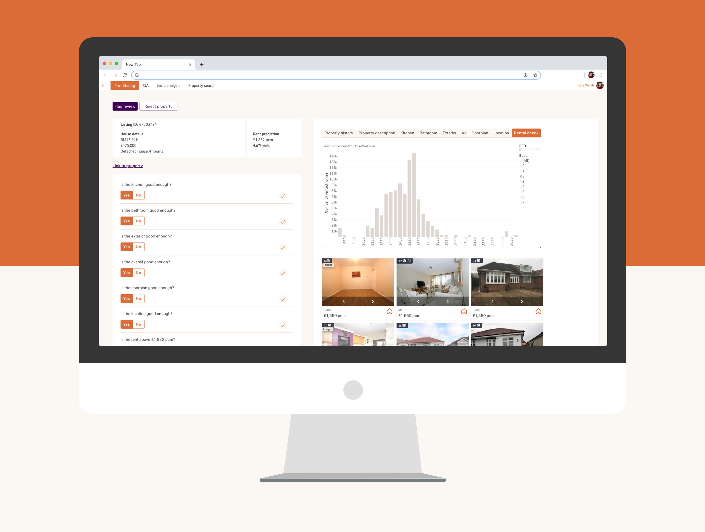
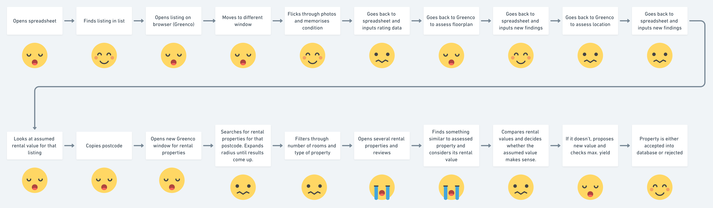
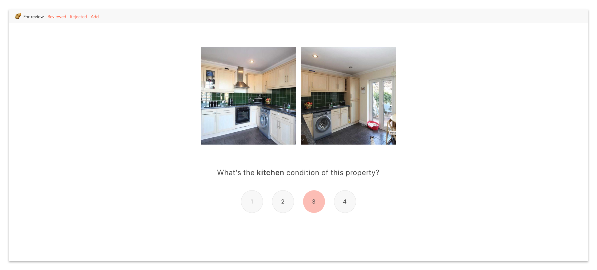
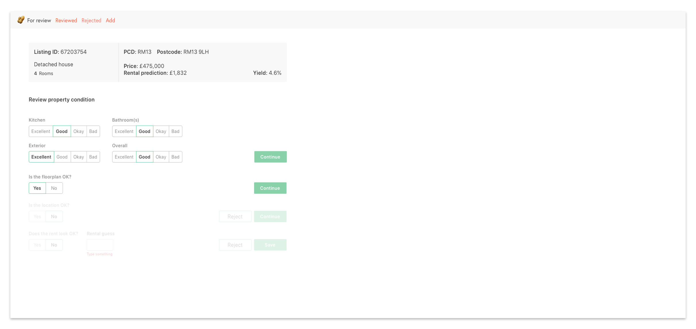

* **Project type:** Work project
* **Duration:** 1 month
* **Tools:** Pen and paper, Sketch, Whimsical, Invision
* **Processes:** User testing, card sorting, mind-mapping, sketching, prototyping

Unmortgage is an alternative to renting that enables customers to gradually purchase the home they live in. Home buyers contribute with a 5% deposit while an institutional investor covers the cost of the rest of the property so that the customer can buy it from them little by little.

One of Unmortgage's main objectives is to be able to procure prospective home buyers with a database of properties they can flick through and choose their perfect house from. In order to build this database, an Operations Team consisting of Property Specialists (PS) has been tasked with filtering through all UK's properties so as to find the ones that would match the expectations of both customers and institutional investors. The PS team has defined what makes a _good enough_ property and they have started a process they call _pre-filtering_.

## The current Pre-Filtering process

The Pre-Filtering process involves a Google Sheet and links to various sources of information. The Google Sheet comprises a long list of links to properties, as well as several columns where the PS team have to input data on the suitability of each property.

> "It's very clunky and difficult to use. As property specialist, we spend too much time switching between cells on the spreadsheet and it’s too easy to make a lot of errors. We’re constantly switching between tabs in the internet browser and it makes it difficult to keep track of the property you’re currently assessing." – Sophia

## The order of factors _does_ change the product

Properties go through a pre-filtering process that involves several stages, and every property can fail at any given stage. This helps our Data Team collect – well – data and have a better understanding of the property market and the type of houses that can be found in different areas across the country.

The following are the numerous steps through which the PS Team will go for every single property they review:

1. How good is the kitchen?
1. How good is the bathroom?
1. How good is the exterior?
1. How good is it on the overall?
1. How good is the room distribution across the floorplan?
1. How good is the location in terms of transport links. neighbourhood, noise...?
1. Does the rent the system predicted for this property match the current market for the area and type of property?

For each of these questions, the PS Team have to go on different sites, flick through images, floorplans, Google Maps and property listings, and then go back to the spreadsheet to fill out each category.

## From rating to discarding

The condition of a kitchen can make or break the deal. If a kitchen is too small or if its appliances and fixtures are too old, it will make the property less attractive to prospective buyers and investors. The same rule applies to bathrooms and outdoor spaces. In order to gather as detailed data as possible, the PS Team were originally tasked with _rating_ kitchens, bathrooms and outdoor spaces independently, giving each a rating of 1-4 where 1 was really bad and 4 was really good.

Therefore, a kitchen that was a 1 would make the entire property fail regardless of the condition of all the other areas within the house. Likewise, a kitchen that was a 4 would make any property pass provided the bathroom and outdoor space were above a 2. This approach had several problems:

1. The PS Team realised it was actually a binary rating; a 2 would make a property fail _unless_ it was otherwise ridiculously great, and a 3 would make a property pass _unless_ it was otherwise ridiculously terrible.
1. The PS Team struggled with objectivity. By reviewing the ratings of several team members we realised that was 'Anna' deemed a 2, 'James' deemed a 3 or even a 1. In many cases, some of them were passing properties that others would have never passed.
1. The extra cognitive load of having to rate rather than discard made the process longer and more painful.

My assumption was that by simply saying YES or NO to a kitchen (where a NO would mean the kitchen was in terrible condition, and a YES would mean it was good enough), we'd be gathering more objective data points (albeit not as detailed) and reducing the cognitive load in the decision process. I tested that by printing out about 20 photos of kitchens and asking them to order them in different ways, such as organising them from _best to worst_ or asking them to rate them comparatively (which of the two is _better_?).

When testing the _Good enough/Not good enough model_, the PS Team managed to make decisions more quickly, speeding up the pre-filtering process – which was one of the main objectives of the new internal tool.

## A tool to rule them all

Inheriting the system that was already in place for other parts of Unmortgage's internal software, I went on to design a tool that would enable the PS Team to speed up the prefiltering process and help us build a database of acceptable properties faster and more robustly.

### Different ways of rating

### First sketches considering different ways of rating conditions

### Iteration 1: Rating with numbers 1-4

### Iteration 2: Rating with numbers 1-4 (one section at a time)

### Iteration 3: Rating with words (Bad - Excellent)

### Iteration 4: Rating _Good Enough_ method: YES/NO

## Final designs: re-working the UI

The original UI lacked some structure and had too much blank space which made it difficult to tell the different sections apart. I opted for a design that would create different sections on top of a layer of subtle colour. The colour palette works well with images of houses, rooms and furniture.

