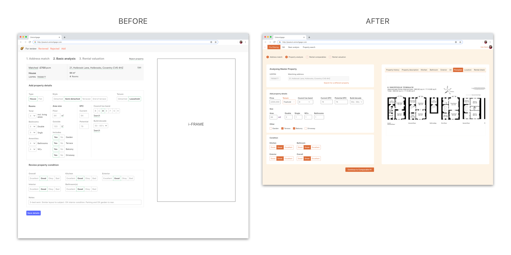

* **Project type:** Work project
* **Duration:** 1 month
* **Tools:** Pen and paper, Sketch, Whimsical, Invision
* **Processes:** User testing, card sorting, mind-mapping, sketching, prototyping

Unmortgage is an alternative to renting that enables customers to gradually purchase the home they live in. Home buyers contribute with a 5% deposit while an institutional investor covers the cost of the rest of the property so that the customer can buy it from them little by little.

One of Unmortgage's main objectives is to be able to procure prospective home buyers with a database of properties they can flick through and choose their perfect house from. In order to build this database, an Operations Team consisting of Property Specialists (PS) has been tasked with filtering through all UK's properties so as to find the ones that would match the expectations of both customers and institutional investors. The PS team has defined what makes a _good enough_ property and they have started a process they call _pre-filtering_.

## The current Pre-Filtering process

The Pre-Filtering process involves a Google Sheet and links to various sources of information. The Google Sheet comprises a long list of links to properties, as well as several columns where the PS team have to input data on the suitability of each property.

> "It's very clunky and difficult to use. As property specialist, we spend too much time switching between cells on the spreadsheet and it’s too easy to make a lot of errors. We’re constantly switching between tabs in the internet browser and it makes it difficult to keep track of the property you’re currently assessing." – Sophia

## The order of factors _does_ change the product

Properties go through a pre-filtering process that involves several stages, and every property can fail at any given stage. This helps our Data Team collect – well – data and have a better understanding of the property market and the type of houses that can be found in different areas across the country.

The following are the numerous steps through which the PS Team will go for every single property they review:

1. How good is the kitchen?
1. How good is the bathroom?
1. How good is the exterior?
1. How good is it on the overall?
1. How good is the room distribution across the floorplan?
1. How good is the location in terms of transport links. neighbourhood, noise...?
1. Does the rent the system predicted for this property match the current market for the area and type of property?

For each of these questions, the PS Team have to go on different sites, flick through images, floorplans, Google Maps and property listings, and then go back to the spreadsheet to fill out each category.

## A tool to rule them all

I went on to design a tool that would enable the PS Team to speed up the pre-filtering process and help us build a database of acceptable properties faster and more robustly.

## Re-designing the UI for the entire back-office software

The original UI for Unmortgage's internal tool was a little bit clunky and lacked structure, so I re-designed the the entire interface by dividing each screen in several components (boxes) that would separate each part of the process.

