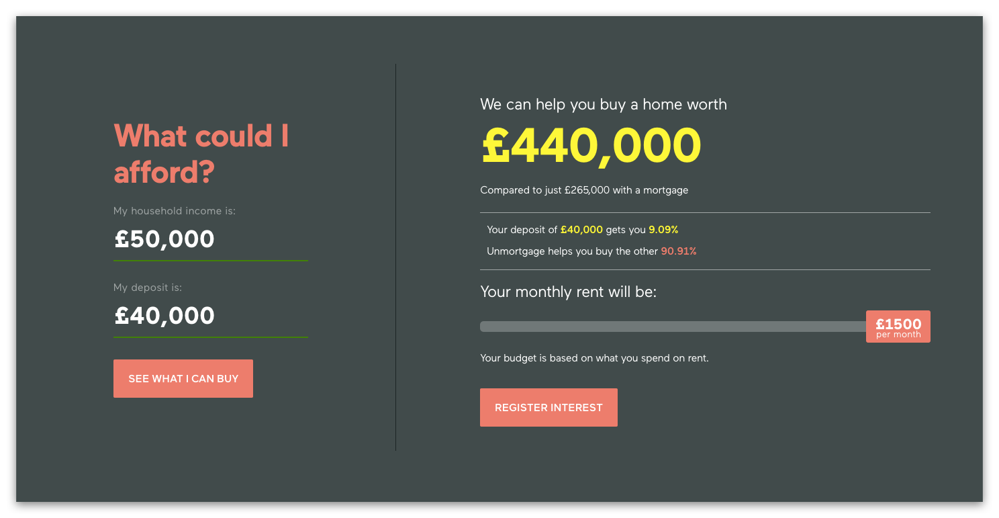
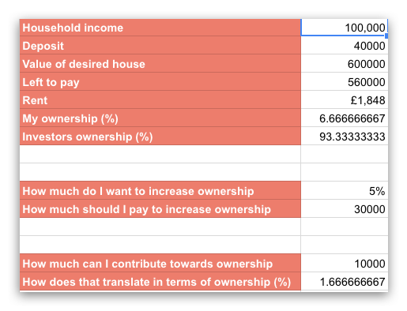
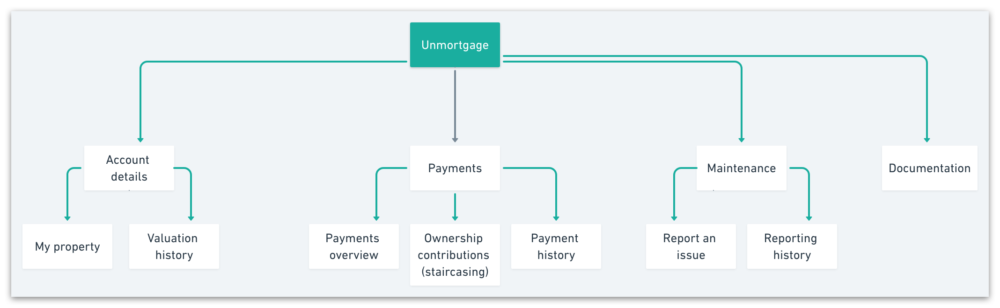
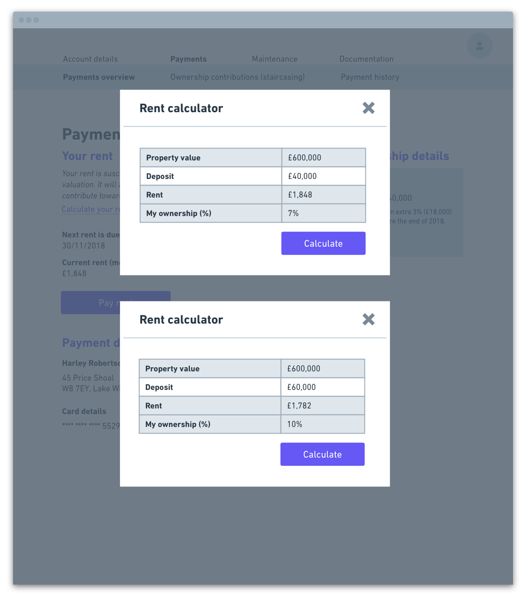

* **Project type:** Technical test
* **Duration:** 3 days
* **Tools:** Pen and paper, Sketch, Whimsical, Figma
* **Processes:** User testing, mind-mapping, sketching, prototyping

> “For people who can afford to rent, but want to own, enjoy the benefits of home ownership with as little as a 5% deposit.
Unmortgage allows you to part own, part rent your dream home.”

[Unmortgage](https://unmortgage.com/){:target="_blank"} is a new startup challenging the mortgage industry, and their concept is simple: you start by owning 5% of your home and an investment company takes responsibility for the remaining 95%, on which you pay a monthly rent. As you continue to buy more of your property, your ownership will increase while your rent will decrease.

## The Brief: Focusing on the Living Experience

As part of their interview process, Unmortgage challenged me to design an app that would solve the following problems for the owner-tenant:

As an owner-tenant...

1. I need to pay my rent every month
2. I need to increase my ownership regularly
3. I need to maintain the property and report maintenance issues
4. I need to be able to access some critical Documents 

## Understanding The Product

My first step was to spend some time on their website to really understand their product. This mostly involved playing with their calculator, which gives you an approximate idea on how much money you could spend on a house with the help of Unmortgage, as opposed to using other means to support your purchase. 

The calculator takes into account two main variables: household income and first-time deposit. 

My main issue with the tool was that I was not able to bring the value of my potential house down, and therefore if I increased my household income both value and rent would exceed my needs and expectations. 

> "Maybe I earn a lot of money but I want to spend little on rent and I have no desire to own a super expensive property" – myself

In this situation, I (as a user) am forced to lie about my income, which is not ideal for Unmortgage (as they can't get as accurate data) nor for the user, who has to play around with the variables until they come up with a result they're happy with.

## Building My Own Calculator

This was probably overkill, but I *really* needed to understand this, so I went back to my trusty Google Sheets and created an "Unmortgage Calculator" where I can play around with several values and find out how much more would I need to contribute to purchase an additional 5% (£30,000) OR how much of my property would £10,000 buy me at this point in time (1.6%).

 

What can I say, this makes me really happy. Maybe I'm weird, who knows. Also, this unexpectedly helped me build the "Rent Calculator" I'm displaying in the next section.

## Defining the Site Map

Given the scope of the brief, I found myself having to think carefully about how all the screens, functionalities and sections would be distributed.

I opted for a two-level navigation, [similar to what Giffgaff do](images/case_studies/unmortgage/Giffgaff.png){:target="_blank"}, but I would require some user tesing to make sure this navigation would make sense to a variety of users.

## Paying Rent

Main problems to cover:

- How to calculate my next payment due
- When will my rent increase and by how much 
- Last payment and calculation breakdown
- Payment history - old invoices etc

#### When will rent increase, and by how much? 
I really struggled with this one because rent can increase due to a change in valuation, which is – I believe – a bit unpredictable and outside the user's control, *but* it can also decrease if the user contributes towards ownership.

I solved this by displaying the next payment date.

.png)

#### Last payment and calculation breakdown

I merged these two together and created a style for "History Pages", as I knew I would need it for other sections as well.

Here, you can see your latest payment as well as all other payments. Since my proposal displays Staircasing, Rent and Maintenance separately (even if paid in bulk), having a calculation breakdown ceased to be important.

.png)

#### Calculating your next payment

The following screen does not enable you to calculate your next payment necessarily, *but* it does let you assess how much your rent will decrease if you contribute towards ownership at this point in time.

On a second thought, I could also try have the calculator within the page to make it more accessible and prompt the user to play with it.

.png)

## Increasing My Ownership

- The current ownership level (starts out with a minimum of 5%)
- Property valuation (This happens 4 times a year)
- Property valuation history
- If I want to make one-off staircasing payment
- Or arrange regular staircasing payment

Displaying current ownership level is done both on the Account Details screen and on the Ownership Contribution screen (within Payments). This is so that the user has all the necessary information at all times and can make informed decisions.

.png)

.png)

#### Displaying valuation history

For this screen I used the aforementioned "History Page" component, and added a graph that would visually introduce the ups and downs of property valuation overtime. 

.png)

#### So what if I want to make a one-off staircasing payment? And what about setting up recurring staircasing?

Both options are accessible through the Staircasing Screen. If you want to contribute as a one-off thing, all you need to do is click on the CTA and input the amount you want to pay towards ownership. The form will tell you how that amount translates into a percentage, and then you can decide whether you pay at the end of the month (alongside your rent) or as soon as possible.

.png)

The tricky bit comes when the user wants to set up a recurring payment *because* they can't exceed the 5% annual contribution allowance. This meant that it had to be very clear what happened to the money once the 5% limit was reached. 

On top of that, I also thought I'd be important that the user could choose how often they would like to make the payment, and what the amount would be. The form will also translate the amount into an ownership percentage based on the number of annual instalments.

.png)

To be honest, I think this screen requires a lot more thinking (and more time).

## Maintanance and Documentation

The user needs to be able to report any maintenance issues they may have, as well as download previous invoices and other documentation. 

The reporting tool is inspired by the tool I use to interact with my property agency when maintenance issues arise. It's fairly straightforwad: you select the type of issue you want to report and a input box appears so that you can add more details and send in your request.

This could also include the ability to add a date, upload an image or include tenant availability. 

.png)

For the reporting history page, of course I used the infamous "History Component" again! For some reason it looks particularly huge on this screen, but don't fret – the final visuals come at the end.

.png)

Finally, I kept the Documentation screen separate from everything else and as simple as possible; it's just a list of file names that function as a link.

.png)

## The Visuals

Using Unmortgage's color palette and a font that looks similar to theirs, I designed the high-fidelity visuals for three of the screens presented above. 

Because this is a site users are going to come back to over and over in order to pay their rent or contribute to the ownership of their property, I decided to combine into a subdued style with a lot of white space and pastel shades.

.png)
.png)
.png)

## Conclusions

This has been the most fun and engaging technical test I've done so far, so thank you Unmortgage for suggesting it!

There are several things that could use a few more time to be thought through, such as the super long and text-heavy "Recurring Staircasing Form" screen, but on the overall I'm pretty happy with this concept.

